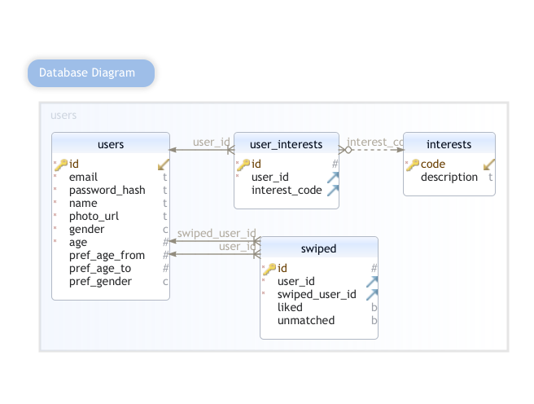

# General Assembly: Project 2: Cupid.
Cupid is an online dating site. Similar to Tinder. 

Cupid allows you to:
- register
- login
- update profile
- add/update interests
- swipe on possible matches
- view current matches

## URL
https://enigmatic-shelf-35474.herokuapp.com/

## Technologies Used
- HTML
- CSS
- Javascript
- Python
- FLASK, Jinja2
- Postgres

## Installation
No installation required. Just click on the URL.

## Database design

## Future Updates
- Add unmatch option
- Add chat option